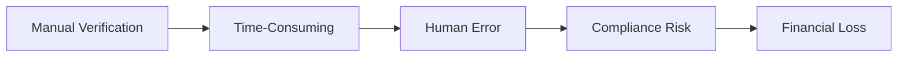
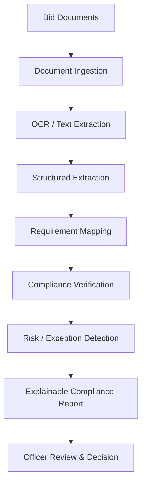
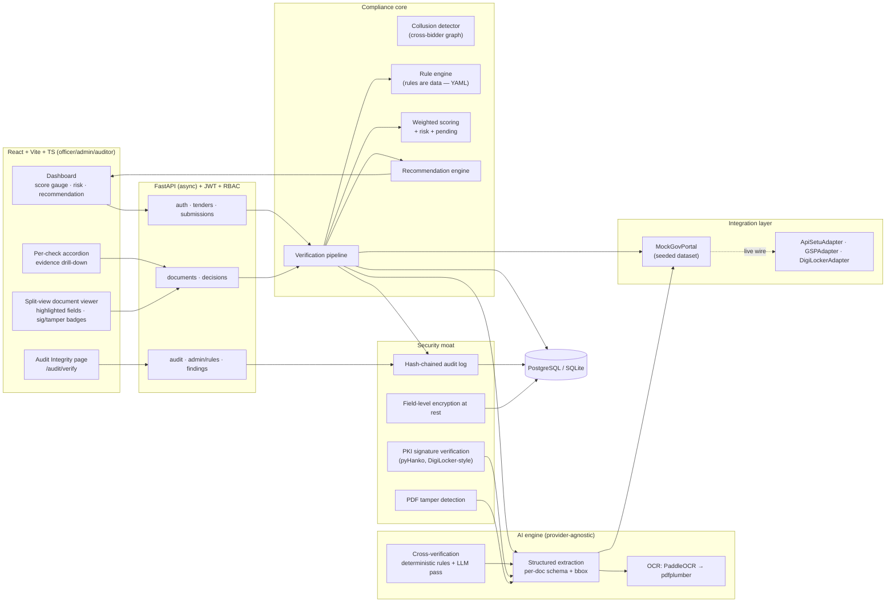

# GeM Bid Compliance Verification Platform
## AI-Powered Integrated Bid Compliance Verification for GeM Procurement

<div align="center">

# 🏛️ AI-Powered GeM Bid Compliance Platform

### Intelligent • Automated • Explainable • Secure

AI-assisted bid compliance verification for Government e-Marketplace procurement.

<p align="center">
  <a href="#quick-start">Quick Start</a> • <a href="#key-features">Features</a> • <a href="#architecture">Architecture</a> • <a href="#installation">Installation</a>
</p>

</div>

<p align="center">
  <strong>Transforming GeM procurement verification with AI + PKI + Hash-chained audit trails</strong>
</p>

<br>

<div align="center">

[](https://www.python.org)
[](https://fastapi.tiangolo.com)
[](https://react.dev)
[](https://typescriptlang.org)
[](https://vitejs.dev)

</div>

<br>

## Table of Contents

- [1. Project Overview](#1-project-overview)
- [2. Problem Statement](#2-problem-statement)
- [3. Our Solution](#3-our-solution)
- [4. Key Features](#4-key-features)
- [5. How It Works](#5-how-it-works)
- [6. System Architecture](#6-system-architecture)
- [7. Technology Stack](#7-technology-stack)
- [8. Project Structure](#8-project-structure)
- [9. Installation](#9-installation)
- [10. Configuration](#10-configuration)
- [11. Usage & Demo](#11-usage--demo)
- [12. Security & Compliance](#12-security--compliance)
- [13. Limitations](#13-limitations)
- [14. Future Scope](#14-future-scope)
- [15. Team](#15-team)
- [16. License](#16-license)

## 1. Project Overview

**GeM (Government e-Marketplace)** is India's national online platform for government procurement, where departments purchase goods and services. The manual verification process is slow, document-heavy, and error-prone.

### The Challenge

| Challenge | Impact |
|-----------|--------|
| Manual cross-checking of 10+ registries | Time-consuming evaluation |
| Bid-rigging / front companies | Financial risk to government |
| Inflated Make-in-India claims | Unfair competition |
| Forged/tampered certificates | Compliance violations |
| "Why was this bidder rejected?" | No audit trail |
| Black-box AI scores | Lack of transparency |

### Our Solution

The platform automates bid compliance verification by:

- ✅ Ingesting 12+ statutory document types (Udyam/MSME, GST, PAN, MCA21, EPFO/ESIC, etc.)
- ✅ AI-powered extraction using PaddleOCR + pdfplumber
- ✅ PKI signature verification (pyHanko) for document authenticity
- ✅ PDF tamper/forgery detection (metadata analysis, revision counting)
- ✅ Cross-bidder collusion detection (shared bank accounts, signatories)
- ✅ Explainable compliance scoring with evidence linking
- ✅ Hash-chained audit log with integrity verification
- ✅ Human-in-the-loop decision support (AI recommends, officers decide)

## 2. Problem Statement

### Current Challenges in GeM Procurement



**Key Problems:**

- **12+ statutory registries** to cross-check per bidder
- **Document forgery** increasingly sophisticated (post-signing modifications)
- **Collusion detection** requires manual cross-referencing
- **No standardized** validation rules across tenders
- **Officer workload** overwhelmed by volume
- **No audit trail** for compliance decisions

### Why Automated Verification?

- **63+ compliance checks** vs manual 10+ registry checks
- **Real-time scoring** vs days-long evaluation
- **Evidence-linked flags** vs opaque rejection reasons
- **Hash-chained audit** vs no trail
- **Collusion detection** automated vs manual observation

## 3. Our Solution

### Verification Pipeline



### Pipeline Steps

1. **Document Upload** - Officer uploads bidder's statutory certificates (GST, PAN, Udyam, etc.)
2. **OCR Extraction** - PaddleOCR (optional) + pdfplumber extracts text + bbox coordinates
3. **Information Extraction** - Structured data extraction per-document schema
4. **Requirement Mapping** - Map extracted fields against procurement requirements
5. **Compliance Verification** - Automated rule-based checks (YAML-driven rule engine)
6. **Risk / Exception Detection** - Flag missing, invalid, or inconsistent data
7. **Explainable Report** - Generate PDF report with score, checks, findings, document statuses
8. **Officer Decision** - Human-in-the-loop: AI recommends, officer qualifies/disqualifies

### Key Components

| Component | Technology | Purpose |
|-----------|-----------|---------|
| **Verification Pipeline** | FastAPI + SQLAlchemy | Orchestrate check sequence |
| **Rule Engine** | YAML-driven | Configurable compliance rules |
| **PKI Verification** | pyHanko + cryptography | Signature authenticity |
| **PDF Tamper Detection** | pikepdf + pypdf | Forgery detection |
| **Collusion Detector** | rapidfuzz + graph analysis | Shared attribute clustering |
| **Compliance Scoring** | Weighted algorithm | 0-100 score + risk level + qualify/needs review/disqualify |

## 4. Key Features

### ✅ Implemented Features

| Feature | Description |
|---------|-------------|
| 📄 **Multi-Document Processing** | 12+ statutory document types (Udyam, GST, PAN, MCA21, EPFO, ESIC, Startup, NSIC, OEM auth, DigiLocker, blacklist, CIN) |
| 🤖 **AI-Assisted Extraction** | PaddleOCR + pdfplumber with bbox-level precision |
| 🔐 **PKI Signature Verification** | pyHanko validates digest, certificate chain, content integrity |
| ⚠️ **PDF Tamper/Forgery Detection** | Incremental update count, /ModDate vs signature timestamp, producer fingerprints |
| 🧩 **Cross-Bidder Collusion Detection** | Shared bank account + authorized signatory clustering |
| 📊 **Compliance Scoring** | Weighted algorithm + risk level + qualify/needs review/disqualify |
| 📧 **Explainable Reports** | One-click PDF export with score, checks, findings, audit-chain head hash |
| 🔐 **Hash-Chained Audit Log** | `this_hash = H(seq|actor|action|entity|payload_hash|prev_hash)`; `/audit/verify` integrity recomputation |
| 🛡️ **RBAC & Auth** | officer/admin/auditor roles; JWT + passlib/bcrypt; rate-limited auth |
| 📦 **Mock Gov Portal** | Seeded synthetic registry for offline demo |

### 🎯 Demo Dataset: 7 Bidders on "Supply of Industrial Pumps" Tender

| Bidder | Intent | Score | Risk | Result |
|--------|--------|-------|------|--------|
| **CleanCorp Industrial Solutions Pvt. Ltd.** | Fully compliant | 95.0 | Low | **Qualify** |
| **Borderline Traders** | GST not filed + PAN/Udyam name mismatch | 87.5 | Medium | Needs Review |
| **FraudFillers Traders** | Forged GST cert + debarment list + inflated Make-in-India | 25.0 | High | **Disqualify** |
| **Kaveri Engineering Works** | Unsigned scans, expired startup recognition | 90.1 | Medium | Needs Review |
| **Southern Pumps LLP** | Fully compliant (manufacturer) | 96.7 | Low | **Qualify** |
| **FrontRunner Pumps Pvt. Ltd.** | Colluding with QuickSpares | 90.6 | Medium | Needs Review |
| **QuickSpares Trading Co.** | Colluding with FrontRunner | 96.2 | Low | **Qualify** |

> **Collusion Demo:** FrontRunner + QuickSpares individually qualify (≥90) but share bank account (`HDFC50200012345678`) + signatory (`K. Verma`) — how bid-rigging actually presents in GeM tenders.

## 5. How It Works

### End-to-End Workflow

1. **Upload Documents** - Officer uploads bidder's statutory certificates (PDFs)
2. **OCR Extraction** - PaddleOCR (optional) + pdfplumber extracts text layers
3. **Information Extraction** - Structured data extraction (GSTIN, PAN, Udyam CIN, etc.)
4. **Requirement Mapping** - Extracted fields mapped against procurement requirements
5. **Compliance Checks** - 12+ automated checks run (GST validity, PAN match, Make-in-India class, etc.)
6. **Risk Analysis** - Score computed + risk level + qualification recommendation
7. **Evidence Linking** - Every flag links to exact source document + field + value
8. **Audit Trail** - Hash-chained log records every step
9. **Decision** - Officer reviews and records qualify/disqualify with justification
10. **Report Export** - One-click PDF with full compliance evidence

### Sample Compliance Check Flow

```mermaid
flowchart TD
    A[Upload GST Certificate] --> B[pdfplumber Text Extraction]
    B --> C[GSTIN Validation (Luhn-mod-36)]
    C --> D[PAN-Udyam Name Match]
    D --> E[GST Returns Filed Check]
    E --> F[Local Content Class Verification]
    F --> G[Score Calculation]
    G --> H{Risk Level}
    H -->|0-50| I[Disqualify]
    H |>50-80| J[Needs Review]
    H |>80| K[Qualify]
```

## 6. System Architecture



### Tech Stack Deviations (Documented)

- **OCR fallback:** pdfplumber text-layer extraction when PaddleOCR absent (demo PDFs are text-based; PaddleOCR is scanned-document upgrade path)
- **Rate limiting:** In-process sliding window (Redis recommended for multi-instance deployments)

## 7. Technology Stack

| Layer | Technology | Details |
|-------|-----------|---------|
| **Backend** | Python 3.11 + FastAPI | Async, JWT auth, RBAC |
| **ORM** | SQLAlchemy 2.0 | Alembic migrations |
| **AI/OCR** | PaddleOCR + pdfplumber | Text extraction with bbox |
| **PDF Processing** | pikepdf + pypdf + reportlab | Signature verification, tamper detection, report generation |
| **Fuzzy Matching** | rapidfuzz | Collusion detection, name matching |
| **Crypto** | cryptography + pyHanko | PKI, Fernet encryption |
| **Rules** | YAML-driven rule engine | Configurable compliance checks |
| **Testing** | pytest + Vitest/RTL | 63 backend tests + 7 frontend tests |
| **Database** | SQLite (default) / PostgreSQL (configurable) | Zero-config via DATABASE_URL |

### Environment Configuration

```env
# from .env.example
DATABASE_URL=sqlite:///./storage/app.db
JWT_SECRET=change-me-in-production-32bytes+
ACCESS_TOKEN_EXPIRE_MINUTES=60
REFRESH_TOKEN_EXPIRE_DAYS=7
ENCRYPTION_KEY=
PORTAL_ADAPTER=mock
LLM_PROVIDER=offline        # offline | openai | ollama | auto
LLM_MODEL=gpt-4o-mini
OLLAMA_BASE_URL=http://localhost:11434
OLLAMA_MODEL=llama3.2
EXPECTED_ISSUER_CN=Demo DigiLocker Issuing CA
CORS_ORIGINS=http://localhost:5173,http://localhost:8080
AUTH_RATE_LIMIT_PER_MINUTE=20
```

## 8. Project Structure

```
gem-bid-compliance-platform/
├── backend/                    FastAPI app (core, models, api, services, checks, ai, security, integration)
│   ├── alembic/              migrations
│   ├── storage/              documents + demo CA (generated)
│   └── tests/                37 pytest tests
├── frontend/                   React + Vite + TS dashboard (officer/admin/auditor)
│   ├── src/
│   │   ├── api/              API client
│   │   ├── auth/             Authentication
│   │   ├── components/       UI components
│   │   ├── pages/            Dashboard, tender, audit pages
│   │   └── main.tsx          Entry point
│   ├── package.json
│   ├── vite.config.ts
│   ├── tailwind.config.js
│   └── tsconfig.json
├── data/                       synthetic dataset generator + generated docs + mock registry
│   ├── generate.py           Dataset builder + signed PDF generator
│   ├── mock_portal.json      Seeded registry
│   └── docs/                 Generated bidder documents (40+ PDFs)
├── docs/                       architecture & production guides
├── docker-compose.yml          db + backend + frontend, one command
├── .env.example              all configuration knobs
├── vercel.json               Full-stack deployment config
└── README.md                 Project documentation
```

## 9. Installation

### Prerequisites

- Python 3.11+
- Node.js 18+
- npm or yarn

### Backend Setup

```bash
# 1. Clone repository
git clone https://github.com/sakshamp413-hash/gem-bid-compliance-platform.git
cd gem-bid-compliance-platform

# 2. Create virtual environment
python -m venv .venv
.venv\Scripts\activate  # Windows
# source .venv/bin/activate  # Linux/macOS

# 3. Install dependencies
pip install -r backend/requirements-dev.txt

# 4. Generate synthetic dataset
python data/generate.py

# 5. Seed database + start backend
cd backend
python -m app.seed
uvicorn app.main:app --reload --port 8000
```

### Frontend Setup

```bash
# 1. Start frontend (new terminal)
cd frontend
npm install
npm run dev  # http://localhost:5173 (proxies /auth,/tenders,… to :8000)
```

### Docker (One-Command)

```bash
docker compose up --build
```

This starts PostgreSQL + backend + frontend; the backend container runs `alembic upgrade head → data/generate.py → seed` automatically.

### Health Check

```
http://localhost:8000/health
# Returns: {"status":"ok","app":"GeM Bid Compliance Verification Platform","database":"ok","adapter":"mock","llm_provider":"offline"}
```

## 10. Configuration

### Environment Variables (.env)

Copy `.env.example` and adjust:

```bash
cp .env.example .env
```

| Variable | Default | Description |
|----------|---------|-------------|
| `DATABASE_URL` | `sqlite:///./storage/app.db` | SQLite zero-config; set to PostgreSQL URL |
| `JWT_SECRET` | `change-me-in-production-32bytes+` | 32+ random bytes for token signing |
| `ACCESS_TOKEN_EXPIRE_MINUTES` | `60` | Access token lifetime |
| `REFRESH_TOKEN_EXPIRE_DAYS` | `7` | Refresh token lifetime |
| `ENCRYPTION_KEY` | (empty) | Fernet key for field-level encryption (generate via `python -c "from cryptography.fernet import Fernet; print(Fernet.generate_key().decode())"`) |
| `PORTAL_ADAPTER` | `mock` | mock | apisetu | gsp | digilocker |
| `LLM_PROVIDER` | `offline` | AI provider: offline | openai | ollama | auto |
| `LLM_MODEL` | `gpt-4o-mini` | LLM model name |
| `EXPECTED_ISSUER_CN` | `Demo DigiLocker Issuing CA` | PKI trust root CN |
| `CORS_ORIGINS` | `http://localhost:5173,http://localhost:8080` | Allowed CORS origins |
| `AUTH_RATE_LIMIT_PER_MINUTE` | `20` | Auth attempt rate limit |

## 11. Usage & Demo

### Demo Accounts

| Role | Email | Password |
|------|-------|----------|
| **Officer** | `officer@gem.gov.in` | `GeM@2026!officer` |
| **Admin** | `admin@gem.gov.in` | `GeM@2026!admin` |
| **Auditor** | `auditor@gem.gov.in` | `GeM@2026!auditor` |

### 5-Minute Demo Pitch

```markdown
1. Login as `officer@gem.gov.in` → open tender **"Supply of Industrial Pumps"** (GeM/2026/B/1234567)
2. **CleanCorp** — green score gauge (94.8), risk **Low**, recommendation **Qualify**. 
   Every check **pass** with evidence; open GST cert — highlighted fields, **Signature valid**, **No tamper flags**.
3. **BorderlineTraders** — risk **Medium**, routed to **Needs Review**. 
   GST check: "GST returns NOT filed (Q3 FY 2025-26)". Cross-verification: **HIGH — PAN name differs from Udyam name**.
4. **FraudFillers** — risk **High**, recommendation **Disqualify**. 
   Red alert: **Signature INVALID**, **⚠ Tampered — modified after signing**. Make-in-India: computed 25% local content from BoM — Class II, not declared Class I.
5. **FrontRunner & QuickSpares** — both individually qualify (≥90)… but the **Cross-bidder integrity** panel clusters them on shared bank account + signatory.
6. **Audit Integrity** (auditor@) — chain verifies **INTACT**. Tamper evidence: edit one row → **CHAIN BROKEN** with first broken link.
```

### Local Development Workflow

```bash
# Backend (terminal 1)
cd backend
.venv\Scripts\activate
uvicorn app.main:app --reload --port 8000

# Frontend (terminal 2)
cd frontend
npm run dev  # http://localhost:5173
```

## 12. Security & Compliance

### Security Features

| Area | Implementation |
|------|---------------|
| **PKI Verification** | pyHanko validates signature digest, certificate chain against trust root, content integrity |
| **PDF Tamper Detection** | Incremental-update count, /ModDate vs signature timestamp, producer fingerprints |
| **Data Encryption** | Field-level Fernet encryption at rest (key from `ENCRYPTION_KEY`) |
| **PII Redaction** | PAN/GSTIN/Udyam/CIN/Aadhaar/email/phone redacted in logs |
| **RBAC** | officer/admin/auditor roles; auth rate-limited |
| **JWT Security** | HS256 with configurable secret; 32+ byte requirement for production |
| **Human-in-the-Loop** | System never auto-disqualifies; overrides require typed justification; every decision audited |

### Compliance Considerations

- **Demo trust is synthetic** - Documents signed by locally generated demo CA; production swaps to real DigiLocker/GSTN/MCA CAs (one config change)
- **Portal adapters are documented stubs** - Live statutory APIs (GSTN, ITD, MCA21, APISetu, DigiLocker) gated behind registration/licensing
- **Thresholds are demo defaults** - MSME caps, local-content classes and check weights labeled for verification against current DPIIT/MSME/GeM policy
- **Rate limiting is in-process** - Correct for single-instance; Redis-backed limiter is production upgrade

### Known Limitations (Honest)

- Portal adapters are documented stubs - live APIs require partner onboarding
- OCR uses PDF text layer for demo corpus - scanned docs need PaddleOCR upgrade
- Rate limiting is in-process - Redis recommended for multi-instance
- PKI demo trust is synthetic - production requires real CA config
- Thresholds are demo defaults - verify against current policy before production

## 13. Limitations

### Current Limitations

| Limitation | Impact | Mitigation |
|------------|--------|------------|
| **Portal adapters are stubs** | Live statutory APIs require partner registration | Documented in `docs/production.md` for APISetu/GSP/DigiLocker onboarding |
| **OCR uses PDF text layer** | Scanned documents need PaddleOCR upgrade | PaddleOCR optional path documented |
| **Rate limiting in-process** | Single-instance only | Redis-backed limiter noted for production |
| **PKI demo trust is synthetic** | Production requires real CA config | One-config-change swap documented |
| **Thresholds are demo defaults** | Need policy verification | Labeled for verification against current DPIIT/MSME/GeM policy |
| **Database: SQLite default** | Not multi-instance | PostgreSQL configurable via `DATABASE_URL` |

### Known Bugs / Edge Cases

- Fraud cert warning during seed is expected (forged doc demo)
- CORS misconfiguration may occur with custom domains
- Environment variable `ENCRYPTION_KEY` must be set for production

## 14. Future Scope

### Planned Enhancements

- **Live Government API Integration** - APISetu / GSP / DigiLocker partner flow
- **PaddleOCR Upgrade** - Scanned document support
- **Redis-Backed Rate Limiting** - Multi-instance deployment
- **Custom Policy Weights** - DPIIT/MSME/GeM policy alignment
- **Advanced Collusion Detection** - Graph-based network analysis
- **Real-Time Collaborative Review** - Multi-officer decision workflow
- **Explainable AI Dashboard** - Detailed confidence scores per check
- **Mobile Responsiveness** - Tablet/phone dashboard access
- **Bulk Bid Processing** - Batch document verification

### Roadmap Priorities (Post-SIH)

1. **Production PKI Trust Root Swap** - Configurable CA integration
2. **Live API Adapters** - APISetu/GSP/DigiLocker onboarding
3. **PaddleOCR Integration** - Scanned document support
4. **Performance Optimization** - Query optimization, caching
5. **User Authentication Enhancement** - Social login, SSO

## 15. Team

### Smart India Hackathon 2026

- **Project Theme:** Smart Automation
- **Sponsor:** Ministry of Petroleum & Natural Gas
- **Problem Statement:** Bid compliance verification for GeM procurement

### Project Contributors

- AI-powered document verification & compliance engine
- Cross-bidder collusion detection system
- PKI signature verification & PDF forgery detection
- Explainable scoring & audit trail implementation
- Full-stack React + FastAPI dashboard development

### Contact

- **GitHub:** [https://github.com/sakshamp413-hash](https://github.com/sakshamp413-hash)
- **Repository:** [https://github.com/sakshamp413-hash/gem-bid-compliance-platform](https://github.com/sakshamp413-hash/gem-bid-compliance-platform)

## 16. License

This project is licensed under the **MIT License**.

```
MIT License

Copyright (c) 2026 GeM Bid Compliance Platform Contributors

Permission is hereby granted, free of charge, to any person obtaining a copy
of this software and associated documentation files (the "Software"), to deal
in the Software without restriction, including without limitation the rights
to use, copy, modify, merge, publish, distribute, sublicense, and/or sell
copies of the Software, and to permit persons to whom the Software is
furnished to do so, subject to the following conditions:

The above copyright notice and this permission notice shall be included in all
copies or substantial portions of the Software.

THE SOFTWARE IS PROVIDED "AS IS", WITHOUT WARRANTY OF ANY KIND, EXPRESS OR
IMPLIED, INCLUDING BUT NOT LIMITED TO THE WARRANTIES OF MERCHANTABILITY,
FITNESS FOR A PARTICULAR PURPOSE AND NONINFRINGEMENT. IN NO EVENT SHALL THE
AUTHORS OR COPYRIGHT HOLDERS BE LIABLE FOR ANY CLAIM, DAMAGES OR OTHER
LIABILITY, WHETHER IN AN ACTION OF CONTRACT, TORT OR OTHERWISE, ARISING FROM,
OUT OF OR IN CONNECTION WITH THE SOFTWARE OR THE USE OR OTHER DEALINGS IN THE
SOFTWARE.
```

---

## 📸 Screenshots

<div align="center">

| Dashboard | Document Viewer | Audit Trail |
|-----------|-----------------|-------------|
|  |  |  |

</div>

> **Note:** Screenshots to be added in `docs/assets/` folder after UI development.

---

<div align="center">

**⭐ Star this repository if you find it useful!**

**🍴 Fork it** to build upon for your own GeM compliance needs.

</div>

---

*Generated with ❤️ for Smart India Hackathon 2026*