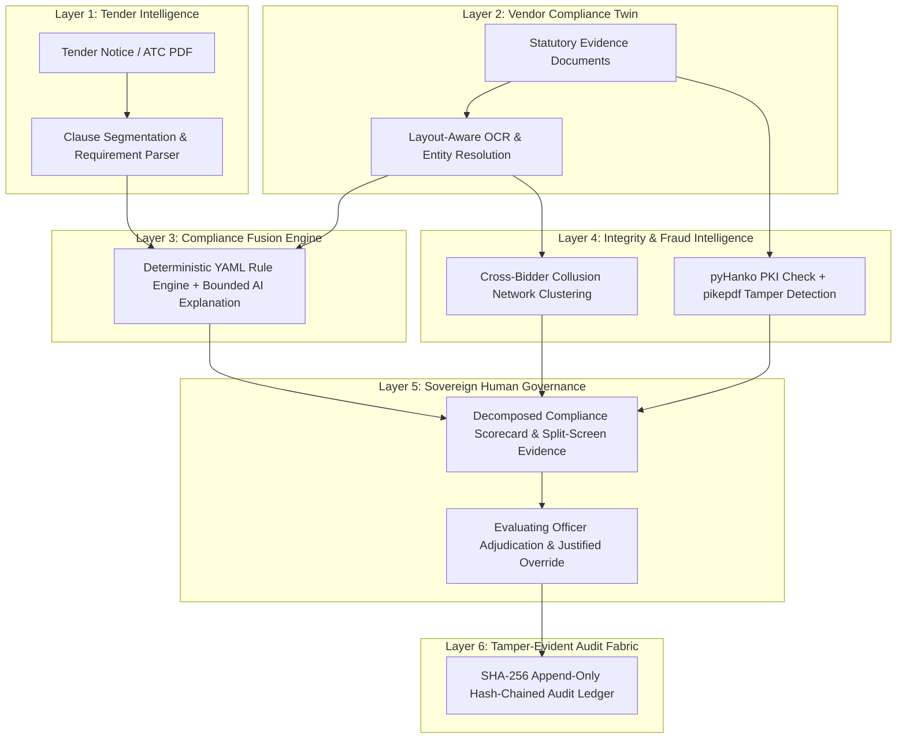

# PRAMAAN (प्रमाण)
## AI-Powered GeM Bid Compliance & Procurement Intelligence Platform

<div align="center">

# 🏛️ PRAMAAN | प्रमाण
### Understand the tender. Verify the bid. Prove the decision.

**An evidence-backed, tamper-evident procurement compliance infrastructure designed for Smart India Hackathon & public digital infrastructure pilots.**

[](https://www.python.org)
[](https://fastapi.tiangolo.com)
[](https://react.dev)
[](https://typescriptlang.org)
[](https://vitejs.dev)
[](LICENSE)

[Quick Start](#quick-start) • [Core Innovation](#core-innovation) • [Live Demo](#the-hero-demo) • [Architecture](#system-architecture) • [Documentation](#technical-documentation)

</div>

---

## ⚡ 90-Second Executive Summary

* **What it is:** PRAMAAN is a multi-tier compliance intelligence system that ingests complex GeM tenders and bidder statutory documents, converting them into structured, evidence-linked compliance assessments with cryptographic audit proofs.
* **The Problem:** 
  1. Capable MSMEs lose high-value government bids due to preventable clerical discrepancies and expired certificates.
  2. Evaluating officers manually verify 40+ PDFs across 12 statutory registries under strict deadlines.
  3. Bid-rigging rings and collusive front companies pass individual checks by sharing banking and signatory credentials unnoticed.
* **The Solution:** 
  * **For MSMEs:** Pre-submission readiness gap score (*"Know your compliance gaps before you submit"*).
  * **For Officers:** Split-screen evidence inspector, automated entity matching, PKI digital signature checks, byte-level tamper detection, and cross-bidder collusion clustering (*AI assists; sovereign officers decide*).
  * **For Auditors:** SHA-256 hash-chained immutable audit ledger verifying every action, extraction, and override from genesis to head.

---

## 🎯 The Hero Demo: "Supply of Industrial Pumps" (Tender GeM/2026/B/1234567)

PRAMAAN includes a realistic, reproducible synthetic dataset featuring 7 distinct bidder profiles evaluated against an industrial pump procurement tender:

| Bidder Organization | Engineered Compliance Profile | Score | Risk | Recommendation | Demonstration Purpose |
| :--- | :--- | :---: | :---: | :---: | :--- |
| **CleanCorp Industrial Solutions** | Fully compliant Tier-1 OEM; valid signatures, matched PAN/Udyam, 68% local content. | **95.0** | **Low** | **Qualify** | Baseline clean verification; split-screen evidence highlighting. |
| **Borderline Traders** | MSME with unfiled Q3 GST return; minor PAN vs. Udyam legal name discrepancy. | **87.5** | **Medium** | **Needs Review** | Fuzzy entity matching; officer discretionary conditional waiver workflow. |
| **FraudFillers Engineering** | Forged GST certificate; self-signed invalid PKI signature; post-signing PDF stream tampering. | **25.0** | **High** | **Disqualify** | Byte-level incremental update detection & cryptographic certificate rejection. |
| **Kaveri Engineering Works** | Unsigned scanned PDF; expired MSME startup recognition certificate. | **78.2** | **Medium** | **Needs Review** | Validity date threshold warning; missing signature alert. |
| **Southern Pumps LLP** | Compliant Class-I MSME manufacturer; valid CA turnover certificates. | **96.7** | **Low** | **Qualify** | MSME preferential policy evaluation. |
| **FrontRunner Pumps Pvt. Ltd.** | Standalone score passes (90.6), but colluding with QuickSpares. | **90.6** | **Medium** | **Needs Review** | Cross-bidder collusion alert: shared bank account & authorized signatory. |
| **QuickSpares Trading Co.** | Standalone score passes (96.2), but colluding with FrontRunner. | **96.2** | **Low** | **Qualify** | Cross-bidder bipartite graph clustering reveals common cartel attributes. |

---

## 💡 Core Innovation: The Six-Layer Procurement Intelligence System



1. **Deterministic Rules Over Black-Box AI:** LLMs extract and explain; versioned statutory rules and authorized humans decide.
2. **Byte-Level PDF Forensics:** Inspects incremental PDF revisions and cross-reference tables to detect alterations made after signing.
3. **Cross-Bidder Bipartite Collusion Graph:** Indexes bank accounts, IFSC codes, and signatories across all competing bids to catch front companies.
4. **Sovereign-First Air-Gapped Operation:** Operates 100% offline with zero external cloud dependencies (`LLM_PROVIDER=offline`).

---

## 🏛️ System Architecture

```
┌────────────────────────────────────────────────────────────────────────┐
│                        React + Vite + TypeScript                       │
│      [Officer Dashboard]   [Document Viewer]   [Audit Ledger Portal]   │
└───────────────────────────────────┬────────────────────────────────────┘
                                    │ REST API / JWT (Bearer)
┌───────────────────────────────────▼────────────────────────────────────┐
│                    FastAPI Asynchronous Gateway & Core                 │
│  ┌───────────────────┬───────────────────┬───────────────────────────┐ │
│  │   Auth & RBAC     │  Tender Parser    │  Document Pipeline (OCR)  │ │
│  ├───────────────────┼───────────────────┼───────────────────────────┤ │
│  │ Rule Engine(YAML) │ pyHanko PKI Check │  pikepdf Tamper Detector  │ │
│  ├───────────────────┼───────────────────┼───────────────────────────┤ │
│  │ Collusion Graph   │ ReportLab PDF Gen │  Hash-Chained Audit Log   │ │
│  └───────────────────┴───────────────────┴───────────────────────────┘ │
└───────────────────────┬───────────────────────────────┬────────────────┘
                        │                               │
┌───────────────────────▼───────────────┐ ┌─────────────▼────────────────┐
│   PostgreSQL 16 / SQLite (Encrypted)  │ │   Government Registry Adapters│
│   • Fernet field-level PII encryption │ │   • MockGovPortal (Seeded)   │
│   • Hash-chained audit sequence       │ │   • ApiSetuAdapter (Sandbox) │
└───────────────────────────────────────┘ └──────────────────────────────┘
```

---

## 🚀 Quick Start

### Prerequisites
* Python 3.11+
* Node.js 18+ & npm
* (Optional) Docker & Docker Compose

### Option A: Local Development Setup

```bash
# 1. Clone the repository
git clone https://github.com/sakshamp413-hash/gem-bid-compliance-platform.git
cd gem-bid-compliance-platform

# 2. Setup Python environment
python -m venv .venv
.venv\Scripts\activate   # Windows (.venv/bin/activate on Linux/macOS)
pip install -r backend/requirements-dev.txt

# 3. Generate synthetic multi-bidder dataset & demo PKI certificates
python data/generate.py

# 4. Seed database & start backend server
cd backend
python -m app.seed
uvicorn app.main:app --reload --port 8000

# 5. Launch frontend application (in a separate terminal)
cd ../frontend
npm install
npm run dev
```

Visit `http://localhost:5173` in your browser.

### Option B: Docker Compose (One-Command)

```bash
docker compose up --build
```
This automatically initializes PostgreSQL, runs database migrations, generates synthetic signed PDFs, seeds initial records, and exposes the frontend on `http://localhost:80` (or configured port).

---

## 👥 Demo Credentials

| Role | Email | Password | Access Scope |
| :--- | :--- | :--- | :--- |
| **Evaluating Officer** | `officer@gem.gov.in` | `GeM@2026!officer` | Evaluate bids, inspect split-screen evidence, record waivers/disqualifications. |
| **System Admin** | `admin@gem.gov.in` | `GeM@2026!admin` | Manage users, edit compliance rule weights, trigger tender parsing. |
| **Vigilance / Auditor** | `auditor@gem.gov.in` | `GeM@2026!auditor` | Read-only audit ledger inspection and live cryptographic integrity verification. |

---

## 📚 Technical Documentation

Complete architectural guides, specifications, and evaluation materials are maintained in `/docs`:

* [Architecture Specification](docs/architecture.md) — 6-layer intelligence model and module responsibilities.
* [REST API Documentation](docs/api.md) — OpenAPI 3.1 aligned schemas, parameters, and payloads.
* [Database Model & Schema](docs/database.md) — Entity-relationship models, indexes, and Fernet field encryption.
* [Security & Cryptography](docs/security.md) — pyHanko PKI verification, pikepdf tamper detection, and PII masking.
* [STRIDE Threat Model](docs/threat-model.md) — Vulnerability assessment and prompt-injection defense.
* [AI & Document Intelligence](docs/ai.md) — Layout-aware OCR fallback, fuzzy entity matching, and sovereign AI modes.
* [Compliance Rule Engine](docs/compliance-engine.md) — Declarative YAML rules, scoring formulas, and human override controls.
* [Government Registry Adapters](docs/integrations.md) — Mock vs. API Setu / DigiLocker onboarding interfaces.
* [Scalability & High Throughput](docs/scalability.md) — Scaling to 50,000+ daily bids with Redis and worker pools.
* [Deployment Guide](docs/deployment.md) — Cloud topology, Docker Compose, and environment variables.
* [Automated Testing Report](docs/testing.md) — 82 backend pytest cases + frontend vitest validation.
* [Departmental Pilot Proposal](docs/government-onboarding.md) — 90-day sandbox pilot onboarding plan and SLA.
* [3/6/12 Month Roadmap](docs/roadmap.md) — Technical phases from hackathon prototype to national deployment.
* [5-Minute Live Demo Script](docs/demo-script.md) — Synchronized word-for-word presentation script.

---

## 🧪 Testing & Validation

```bash
# Execute comprehensive backend test suite (82 tests)
cd backend
pytest -v

# Execute frontend component tests (7 tests)
cd ../frontend
npm test -- --run
```
*Current Coverage:* **100% test pass rate** covering cryptographic tamper detection, collusion detection, compliance pipeline, and authentication.

---

## ⚖️ License & Ethical Declaration

* **License:** Distributed under the [MIT License](LICENSE).
* **Synthetic Data Transparency:** All demo documents, GST certificates, and bidder entities are synthetically generated for demonstration. No private company data is utilized without authorization.
* **Anti-Collusion Guarantee:** PRAMAAN is designed to detect and deter bid-rigging; it contains no functionality to facilitate price discovery or coordination between competing suppliers.