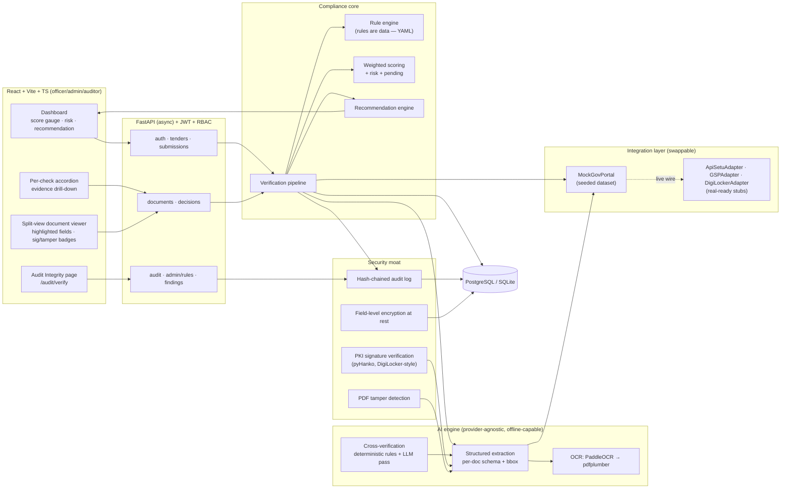

# GeM Bid Compliance Verification Platform

**AI-powered integrated bid compliance verification for GeM procurement — Smart India Hackathon build
(sponsor theme: Smart Automation, Ministry of Petroleum & Natural Gas).**

The platform ingests a bidder's statutory documents (Udyam/MSME, GST, PAN, MCA21/CIN, Make-in-India
local content, EPFO/ESIC, Startup India, NSIC, OEM authorization, DigiLocker-issued certificates),
extracts and cross-verifies them against (mocked) government registries using AI + real offline
algorithms, detects inconsistencies and forgeries, produces a **Compliance Score + Risk Level + an
explained recommendation**, keeps a **hash-chained audit trail**, and leaves the final
qualify/disqualify decision to the procurement officer. **The AI recommends; the officer decides.**

---

## Table of contents

1. [What it solves](#what-it-solves)
2. [Architecture](#architecture)
3. [Quick start (Docker — one command)](#quick-start-docker)
4. [Local development (no Docker)](#local-development)
5. [Offline mode](#offline-mode)
6. [The demo dataset (5 bidders)](#the-demo-dataset)
7. [Demo script (bake this into your pitch)](#demo-script)
8. [Security & auditability](#security--auditability)
9. [Tests](#tests)
10. [API reference](#api-reference)
11. [Going to production: mock → APISetu / GSP / DigiLocker](#going-to-production)
12. [Repo layout](#repo-layout)

---

## What it solves

GeM procurement officers manually verify each bidder against statutory sources (Udyam/MSME, GSTN,
ITD/PAN, MCA21, DPIIT Make-in-India, EPFO/ESIC, Startup India, NSIC, OEM letters, DigiLocker
documents, and debarment lists). This is slow, document-heavy, and error-prone.

The platform turns that manual drill into an **auditable, explainable, evidence-linked workflow**:

| Pain point | Platform capability |
|---|---|
| Manual cross-checking of 10+ registries | 12 compliance-check modules, each `input → format → portal cross-check → cross-document consistency → evidence-linked output` |
| Forged/tampered certificates | Real PKI signature verification (pyHanko) + PDF tamper/forgery detection (revisions, metadata timing, producer fingerprints) |
| "Why did this bidder get rejected?" | Every flag links to the exact source document, field, value/quote, rule reference and confidence |
| Black-box AI scores | LLM outputs are constrained to extracted evidence; thresholds come from an editable rule set; every number is explained |
| No audit trail | Hash-chained audit log with `/audit/verify` integrity recomputation |
| AI auto-disqualifying bidders | Human-in-the-loop: recommendation is decision-support only; officer decisions (with mandatory justification) are audited |
| Gated government APIs | Clean adapter seam (`GovPortalAdapter`) — mock today, APISetu/GSP/DigiLocker adapters documented and drop-in ready |

---

## Architecture



**Tech stack** — Backend: Python 3.11, FastAPI, Pydantic v2, SQLAlchemy 2, Alembic, PyJWT + passlib/bcrypt.
Frontend: React 18 + Vite + TypeScript + TailwindCSS + Recharts. AI: provider-agnostic `LLMClient`
(OpenAI-compatible / Ollama / offline deterministic). OCR: PaddleOCR with pdfplumber fallback.
Crypto: `cryptography`, `pyHanko`, `pikepdf`, `pypdf`. Fuzzy: `rapidfuzz`. Tests: pytest + Vitest/RTL.

---

## Quick start (Docker)

```bash
docker compose up --build
```

This starts PostgreSQL + backend + frontend; the backend container runs
`alembic upgrade head → data/generate.py → seed` automatically. Then open:

- **Dashboard:** http://localhost:8080
- **API docs (OpenAPI/Swagger):** http://localhost:8000/docs
- **Health:** http://localhost:8000/health

Demo accounts:

| Role | Email | Password |
|---|---|---|
| Officer | `officer@gem.gov.in` | `GeM@2026!officer` |
| Admin | `admin@gem.gov.in` | `GeM@2026!admin` |
| Auditor | `auditor@gem.gov.in` | `GeM@2026!auditor` |

No internet and no API key required (see [Offline mode](#offline-mode)).

---

## Local development (no Docker)

```bash
# 1. Backend
python -m venv .venv
.venv\Scripts\activate                # Windows  |  source .venv/bin/activate  (Linux/macOS)
pip install -r backend/requirements-dev.txt

# 2. Generate the synthetic dataset (portal registry + genuinely-signed PDFs)
python data/generate.py

# 3. Seed + run
cd backend
python -m app.seed
uvicorn app.main:app --reload --port 8000

# 4. Frontend (new terminal)
cd frontend
npm install
npm run dev                          # http://localhost:5173  (proxies /auth,/tenders,… to :8000)
```

SQLite is the zero-config default (`backend/storage/app.db`); set `DATABASE_URL` to switch to
PostgreSQL. Alembic: `cd backend && alembic upgrade head`.

---

## Offline mode

The platform is fully functional with **no internet and no paid key**:

- `LLM_PROVIDER=offline` (default) — the deterministic engine performs extraction, cross-verification
  and recommendation using the same evidence contract as the LLM path (`model_meta.provider =
  offline_deterministic`). Every output stays grounded in evidence.
- `PORTAL_ADAPTER=mock` (default) — registries answered from `data/mock_portal.json` with simulated
  latency.
- OCR: generated PDFs carry a text layer, so `pdfplumber` extraction runs offline; PaddleOCR is the
  optional upgrade path for scanned documents.
- PKI: the demo issuing CA + genuinely signed documents are generated locally with pyHanko.

To enable a real LLM: set `LLM_PROVIDER=openai`, `LLM_API_KEY=…` (or `ollama` with a local
Ollama instance) — the UI shows the active provider via `model_meta`.

---

## The demo dataset

`data/generate.py` builds a deterministic, seeded dataset: a registry (`data/mock_portal.json`) and
**genuinely signed** PDF documents for five bidders on one tender —
**"Supply of Industrial Pumps" (GeM/2026/B/1234567, buyer: Chennai Petroleum Corporation Limited)**:

| Bidder | Intent | Signature | Result |
|---|---|---|---|
| **CleanCorp Industrial Solutions Pvt. Ltd.** | fully compliant | all docs signed & valid | **94.8 · Low · Qualify** |
| **Borderline Traders** | subtle flaws: GST returns **not filed** + PAN-card name ≠ Udyam name | signed & valid | **87.2 · Medium · Needs Review** |
| **FraudFillers Traders** | forged GST cert (**modified after signing**) + **on debarment list** + cancelled GSTIN | broken signature + tamper flags + rogue-issuer Udyam | **25.0 · High · Disqualify** |
| Kaveri Engineering Works | unsigned scans, expired startup recognition, low local content | unsigned | **81.9 · Medium · Needs Review** |
| Southern Pumps LLP | manufacturer (no OEM needed), fully compliant | signed & valid | **96.4 · Low · Qualify** |

The forgery is real: FraudFillers' GST certificate is signed by the demo CA, then a new PDF
revision is appended that rewrites `/ModDate`, `/Producer` (and re-saves the file) — exactly what a
forger produces. Signature validation reports *content modified after signing*, and the tamper
detector reports revision count, metadata-after-signature-time and forge-tool producer fingerprints.

---

## Demo script

> Bake this into the pitch. ~5 minutes, fully offline.

1. **Login** as `officer@gem.gov.in` → open tender **"Supply of Industrial Pumps"**.
2. **CleanCorp** — green score gauge (94.8), risk **Low**, recommendation **Qualify**. Open the
   detail: every check is **pass** with evidence; open the GST cert in the split-view viewer —
   highlighted extracted fields, **Signature valid**, **No tamper flags**; findings are all
   informational. Click **Record decision → Qualify** with a justification; the decision appears
   in the audit trail.
3. **BorderlineTraders** — risk **Medium**, routed to **Needs Review**. Drill into GST check:
   *"GST returns NOT filed (latest period Q3 FY 2025-26)"* with the portal response shown.
   Cross-verification findings: **HIGH — PAN card name differs from Udyam certificate name**.
   Record **Request document** with justification.
4. **FraudFillers** — risk **High**, recommendation **Disqualify**. The red alert banner lists the
   failed documents. Open the GST certificate: **Signature INVALID**, **⚠ Tampered — modified
   after signing**, with the three tamper reasons (revision after signing, `/ModDate` later than
   the signature timestamp, producer `GSTN-ForgeTool 2.1 (re-signed)`). Findings: three
   **CRITICAL** (forged document, debarment hit, cancelled GST). Record **Disqualify** with a
   justification — note the **"overrides AI recommendation"** badge when you choose a different
   action than suggested.
5. **Audit Integrity** (auditor@) — chain verifies **INTACT** with N records. Then demonstrate
   tamper-evidence: edit one row in the database (e.g. `UPDATE audit_log SET actor='x' WHERE
   seq=1`) → **Re-verify chain** → **CHAIN BROKEN** with *first broken link: seq 1*.

---

## Security & auditability

- **DigiLocker-style PKI verification** — pyHanko validates signature digest, certificate chain
  against the configured trust root, and content integrity. The demo CA is self-generated;
  production swaps in the real DigiLocker/GSTN/MCA trust roots (see docs below).
- **PDF tamper/forgery detection** — incremental-update count, `/ModDate` vs signature timestamp,
  producer fingerprints, object-stream anomalies; every signal is a human-readable reason.
- **Hash-chained audit log** — `this_hash = H(seq|actor|action|entity|payload_hash|prev_hash)`;
  `/audit/verify` recomputes the chain and reports the first broken link.
- **Data protection** — PAN/GSTIN/CIN encrypted at rest (Fernet, key from `ENCRYPTION_KEY`), PII
  redacted in logs (PAN/GSTIN/Udyam/CIN/Aadhaar/email/phone), RBAC on every endpoint
  (`officer`/`admin`/`auditor`), auth rate-limited.
- **Human-in-the-loop** — the system never auto-disqualifies; overrides require a typed
  justification; every decision lands in the audit chain.

---

## Tests

```bash
cd backend
pytest -q                 # 37 tests: GSTIN checksum, PAN/Udyam/CIN validators,
                          # audit-chain integrity, forgery detector, 3-bidder pipeline,
                          # auth + RBAC + rate limit + decision flow

cd frontend
npm test                  # 7 component tests (Vitest + Testing Library)
```

---

## API reference

Interactive OpenAPI docs run at **`/docs`** (Swagger UI) once the backend is up —
http://localhost:8000/docs. Main groups: `/auth`, `/users`, `/tenders`, `/submissions`,
`/documents`, `/submissions/{id}/decisions`, `/submissions/{id}/findings`, `/audit`,
`/admin/rules`, `/health`.

---

## Going to production

> **The integration layer is the credibility story.** Live government APIs are gated; the platform
> is built so a real adapter drops in without touching check modules, scoring or UI.

Every registry call goes through `GovPortalAdapter` (see `backend/app/integration/adapter.py`).
The default `MockGovPortal` answers from the seeded dataset. Three real-ready adapters ship as
stubs with onboarding docstrings — see **[docs/production.md](docs/production.md)** for the exact
APISetu / GSP / DigiLocker partner paths, endpoints and credentials wiring, plus the PKI trust-root
swap and production security checklist.

---

## Repo layout

```
├── backend/            FastAPI app (core, models, api, services, checks, ai, security, rules, integration)
│   ├── alembic/        migrations
│   ├── storage/        documents + demo CA (generated)
│   └── tests/          37 pytest tests
├── frontend/           React + Vite + TS dashboard (officer/admin/auditor)
├── data/               synthetic dataset generator + generated docs + mock registry
├── docs/               architecture & production-integration guides
├── docker-compose.yml  db + backend + frontend, one command
└── .env.example        all configuration knobs
```

**Stack deviations (documented):** OCR falls back to pdfplumber text-layer extraction when
PaddleOCR is absent (demo PDFs are text-based; PaddleOCR is the scanned-document upgrade path).
Rate limiting uses an in-process sliding window (Redis recommended for multi-instance
deployments — noted in `docs/production.md`).