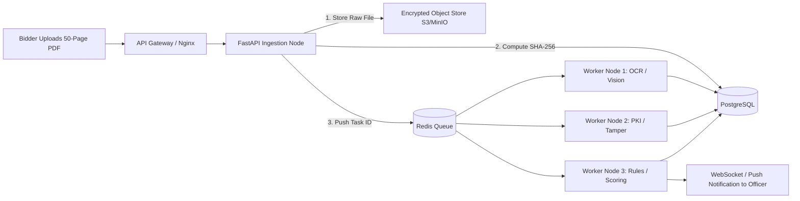

# Scalability & High-Throughput Operations

This document outlines the architectural specifications required to scale PRAMAAN to handle 50,000+ daily procurement bid verifications.

---

## 1. Workload Characteristics & Bottlenecks
* **Read-Heavy Queries:** Tenders, submissions list, audit trail inspection (90% read).
* **Burst-Upload Spikes:** 70% of tender bids are submitted in the final 2 hours before the closing deadline.
* **CPU-Bound Operations:** PDF byte-level incremental scanning, pyHanko cryptographic signature validation, and PaddleOCR image inference.

---

## 2. Horizontal Scaling & Decoupled Task Pipeline

### 2.1 Asynchronous Background Workers
* Main API request threads **never** block on long-running OCR or PDF forensics.
* The API returns `202 Accepted` with a `task_id` and tracking status (`PROCESSING`, `COMPLETED`, `FAILED`).
* Redis queues distribute CPU-intensive extraction tasks across worker pools that scale horizontally via Kubernetes Horizontal Pod Autoscaler (HPA) based on CPU/Queue depth metrics.

---

## 3. Caching & Query Optimization
1. **Statutory Registry Caching:** External registry responses (GSTIN status, PAN details) are cached in Redis with a 24-hour Time-to-Live (TTL), reducing outbound network calls by over 80%.
2. **Database Read Replicas:** Read-heavy dashboard queries are routed to read replicas, preserving the primary database node for transactional audit log commits.
3. **Optimized Pagination:** All audit log and submission queries utilize keyset-based cursor pagination (`WHERE sequence_id > :last_seen ORDER BY sequence_id ASC LIMIT 50`) rather than expensive SQL `OFFSET` scans.
